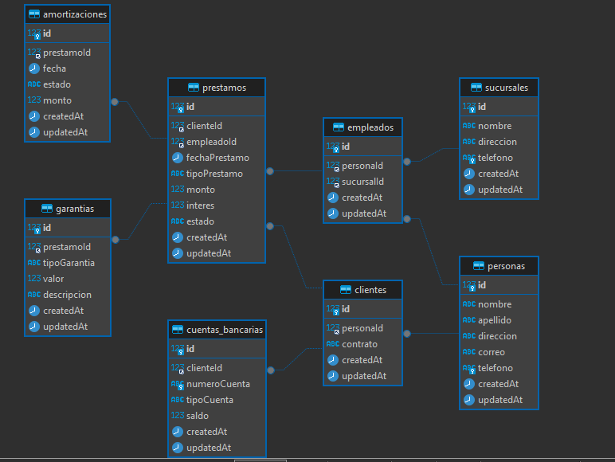

# Proyecto de Gestión de Préstamos

Este proyecto es una API de gestión de préstamos que permite manejar clientes, empleados, sucursales, préstamos, garantías, amortizaciones y cuentas bancarias. Está construido utilizando Node.js, TypeScript y Sequelize como ORM para interactuar con una base de datos MySQL.

## Estructura del Proyecto

- **Modelos**: Se han creado modelos para representar las entidades del sistema:
  - **Cliente**: Contiene información sobre los clientes.
  - **Persona**: Información personal de los clientes.
  - **Sucursal**: Detalles sobre las sucursales.
  - **Empleado**: Relación entre empleados y sucursales.
  - **Prestamo**: Información sobre los préstamos.
  - **Garantia**: Información sobre las garantías asociadas a los préstamos.
  - **Amortizacion**: Detalles sobre las amortizaciones de los préstamos.
  - **CuentaBancaria**: Información sobre las cuentas bancarias de los clientes.

- **Controladores**: Se han implementado controladores para manejar la lógica de negocio de las entidades mencionadas anteriormente. Cada controlador tiene métodos para:
  - Crear nuevos registros.
  - Obtener todos los registros o un registro específico.
  - Actualizar registros existentes.
  - Eliminar registros.

- **Rutas**: Se han definido rutas para cada controlador, permitiendo el acceso a las funciones de la API a través de solicitudes HTTP.

## Modelo Relacional

A continuación se presenta el modelo relacional del sistema:



## Instalación

Para clonar el repositorio y configurar el proyecto en tu máquina local, sigue los siguientes pasos:

1. **Clona el repositorio**:
   ```bash
   git clone <URL_DEL_REPOSITORIO>
   cd <NOMBRE_DEL_REPOSITORIO>

# NOTA: 
INSTALAR LAS DEPENDENCIAS CON:
```bash
npm install 
npm install morgan nodemon 
npm install sequelize mysql2 @types/sequelize
